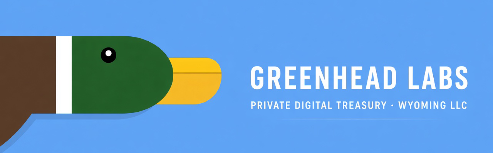
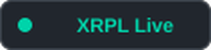
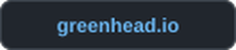
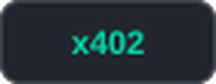
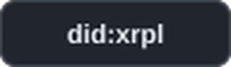

<div align="center">
  
  <p>Pay-per-call XRPL APIs and on-chain identity. Application source stays private.</p>
  <p>
    <a href="https://x402.greenhead.io/status"></a>
    <a href="https://greenhead.io"></a>
    <a href="https://x402.greenhead.io"></a>
    <a href="https://greenhead.io/did"></a>
    <a href="https://x.com/Greenhead_io"></a>
  </p>
</div>

---

Wyoming LLC · Est. 2025. Verifiable identity, treasury credentials, and HTTP 402 micropayments on the XRP Ledger.

> Private company. Not a fund, exchange, or custodian. No investment products, securities, or custodial services.

## Surfaces

| Product | What it is | Link |
| :--- | :--- | :--- |
| **[x402](https://x402.greenhead.io)** | Pay-per-request XRPL data and Grok AI. HTTP 402 → pay on-ledger → retry. No accounts or API keys. | [Docs](https://x402.greenhead.io/docs) |
| **[Quack Protocol](https://greenhead.io/quack-protocol)** | Payment coordination for AI-native operations. Request → authorize → settle. Coordination, not custody. | [Overview](https://greenhead.io/quack-protocol) |
| **[Identity](https://greenhead.io/did)** | W3C `did:xrpl` documents and verifiable credentials for company, agent, and treasury. | [Credentials](https://greenhead.io/credentials) |
| **[Trade Desk](https://greenhead.io/trader)** | Public market context. Information, not instruction. | [Overview](https://greenhead.io/trader) |

Also: [Duck Nest](https://greenhead.io/ducknest) · [Quack Board](https://greenhead.io/quack-board) · [Lab](https://greenhead.io/lab) · [AI](https://greenhead.io/ai) · [Team](https://greenhead.io/Ourteam) · [Company](https://greenhead.io/greenheadlabs)

## x402

[Live on XRPL mainnet](https://x402.greenhead.io/status) (`xrpl:0`, RPC reachable). Read the catalog, pay `payTo`, retry once with the Payment hash.

```bash
curl -s https://x402.greenhead.io/.well-known/x402
```

1. `GET` the catalog (free). Note `payTo`, `network` (`xrpl:0`), and price.
2. Send that XRP amount, or 0.01 RLUSD, to `payTo`. Wait for validation.
3. Retry with `X-Payment-Txid: <64-hex hash>`. Each hash is single-use.

Agents: [llms.txt](https://x402.greenhead.io/llms.txt) · [OpenAPI](https://x402.greenhead.io/openapi.json) · [Skill](https://x402.greenhead.io/skills/x402/SKILL.md) · [Status](https://x402.greenhead.io/status)

## Identity

Machine-readable. No login required. Treasury and agent accounts are listed in the XRPL TOML.

| Record | Value |
| ---: | :--- |
| Legal name | Greenhead Labs LLC |
| Jurisdiction | Wyoming, United States |
| Entity | Single-member LLC |
| Founded | 2025 |
| Company DID | [`did:xrpl:r3E25CzRmwMRNmT15mD3s8tLP9fZHbmN7B`](https://dev.uniresolver.io/#did:xrpl:r3E25CzRmwMRNmT15mD3s8tLP9fZHbmN7B) |
| XRPL TOML | [greenhead.io/.well-known/xrp-ledger.toml](https://greenhead.io/.well-known/xrp-ledger.toml) |
| DID document | [greenhead.io/did.json](https://greenhead.io/did.json) |

[ID](https://greenhead.io/Id) · [Agent](https://greenhead.io/Agent) · [Treasury](https://greenhead.io/Treasury) · [Domain linkage](https://greenhead.io/.well-known/did-configuration.json)

## Contact

[greenhead.io/flight-path](https://greenhead.io/flight-path) · [admin@greenhead.io](mailto:admin@greenhead.io) · [legal@greenhead.io](mailto:legal@greenhead.io) · [@Greenhead_io](https://x.com/Greenhead_io) · [LinkedIn](https://www.linkedin.com/company/greenhead-labs/)

Legal notices: [greenhead.io/legal](https://greenhead.io/legal)

---

<div align="center">
  <sub>© 2026 Greenhead Labs LLC · Wyoming · Est. 2025 · greenhead.io</sub><br />
  <sub>Private company. Does not offer investment products, financial services, securities, or custodial services.</sub>
</div>
