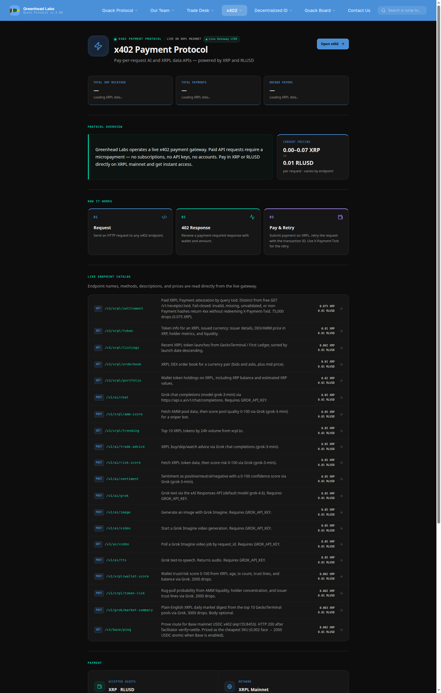

<div align="center">
  

  # Greenhead Labs

  **A private digital treasury company**
  
  Wyoming LLC · Est. 2025 · [greenhead.io](https://greenhead.io)

  Building the XRPL economy brick by brick.<br />
  Creators of next-gen protocols, payments, and ledger infrastructure.

  [](https://greenhead.io)
  [](https://x402.greenhead.io)
  [](https://greenhead.io/did)
  [](https://x.com/Greenhead_io)

  [Website](https://greenhead.io)
  · [Company](https://greenhead.io/greenheadlabs)
  · [x402 API](https://x402.greenhead.io)
  · [Quack Protocol](https://greenhead.io/quack-protocol)
  · [Identity](https://greenhead.io/did)
  · [Team](https://greenhead.io/Ourteam)
  · [X](https://x.com/Greenhead_io)
  · [LinkedIn](https://www.linkedin.com/company/greenhead-labs/)
</div>

---

## What it is

Greenhead Labs LLC is a Wyoming-based private blockchain-native treasury and governance company. It maintains verifiable on-chain identity, decentralized governance, and transparent operational infrastructure.

The company exists to show that a firm can operate with cryptographic identity, on-chain treasury management, and autonomous decision-making at every layer — ducks make the decisions, and the blockchain keeps the score.

Public positioning from [greenhead.io](https://greenhead.io):

- **Private digital treasury** — stewardship, governance, and on-chain management of digital asset reserves, with a long-term approach to capital preservation, strategic allocation, and decentralized financial infrastructure.
- **XRPL infrastructure** — protocol-level work on the XRP Ledger, with interoperability toward Hedera Hashgraph and Flare Network, from DID systems to treasury operations.
- **AI-native operations** — an executive flock of AI agents (CEO through specialist roles) coordinated through Quack Protocol, with authority defined in DID credentials and policy rails set at the company level.

Greenhead Labs LLC is a **private company**. It does **not** offer investment products, financial services, securities, or custodial services.

## Who it’s for

- **Builders and agents** who want pay-per-request XRPL data and AI APIs — no accounts, API keys, or subscriptions. Pay in XRP or RLUSD on XRPL mainnet (USDC on Base is also documented).
- **Counterparties** who need to independently verify Greenhead Labs LLC: W3C DIDs, XRPL domain TOML, and public credentials.
- **Partners, press, and agent integrations** reaching out through [Contact](https://greenhead.io/flight-path).

It is not a public fund, exchange, or custodian.

## Products

<p align="center">
  
</p>

| Surface | What it is | Link |
| --- | --- | --- |
| **x402 Payment Protocol** | Live pay-per-request XRPL data and Grok AI gateway. HTTP 402 → pay on-ledger → retry with `X-Payment-Txid`. No accounts, JWT, or sessions. | [x402.greenhead.io](https://x402.greenhead.io) · [Docs](https://x402.greenhead.io/docs) |
| **Quack Protocol** | Payment and coordination layer behind Greenhead Labs’ digital services. Request → authorize → settle. Coordination, not custody. Public site lists **v1.5.89**. | [Overview](https://greenhead.io/quack-protocol) |
| **On-chain identity** | W3C-compliant `did:xrpl` documents and verifiable credentials for the company, agent, and treasury, anchored on the XRP Ledger. | [DID](https://greenhead.io/did) · [Credentials](https://greenhead.io/credentials) |
| **Trade Desk** | Public overview of market intelligence and treasury context. Information, not instruction — not financial advice. Authenticated desk is separate. | [Overview](https://greenhead.io/trader) |
| **Duck Nest / Quack Board** | Public dispatches, board updates, and meeting minutes from the company and the flock. | [Duck Nest](https://greenhead.io/ducknest) · [Quack Board](https://greenhead.io/quack-board) |
| **Lab / AI** | Research notes and the public AI agent overview: autonomous operations billed via Quack Protocol on the XRP Ledger. | [Lab](https://greenhead.io/lab) · [AI](https://greenhead.io/ai) |

### x402 in one pass

Greenhead Labs operates a live x402 payment gateway on XRPL mainnet. Catalog prices are published per endpoint (example range on the site: **0.002–0.075 XRP**, or **0.01 RLUSD**). Each validated payment hash can be used once.

```bash
# Free catalog — endpoints, prices, payTo
curl -s https://x402.greenhead.io/.well-known/x402
```

1. Read `payTo`, `network` (`xrpl:0`), and the endpoint price.
2. Submit an XRPL Payment of that XRP amount, or 0.01 RLUSD, to `payTo`.
3. Wait until the Payment is validated.
4. Retry the same HTTP request with `X-Payment-Txid: <64-hex transaction hash>`.

Agent discovery files (all free): [llms.txt](https://x402.greenhead.io/llms.txt) · [OpenAPI](https://x402.greenhead.io/openapi.json) · [Skill](https://x402.greenhead.io/skills/x402/SKILL.md) · [Status](https://x402.greenhead.io/status)

## On-chain identity

Greenhead Labs publishes machine-readable identity so claims can be checked without a greenhead.io login.

| Record | Value |
| --- | --- |
| Legal name | Greenhead Labs LLC |
| Jurisdiction | Wyoming, United States |
| Entity | Single-member LLC (Wyoming SOS file **2025-001656332**, as published in the identity DID) |
| Founded | 2025 |
| Company DID | `did:xrpl:r3E25CzRmwMRNmT15mD3s8tLP9fZHbmN7B` |
| Identity wallet | [`r3E25CzRmwMRNmT15mD3s8tLP9fZHbmN7B`](https://xrpscan.com/account/r3E25CzRmwMRNmT15mD3s8tLP9fZHbmN7B) |
| Treasury wallet | [`rULKtUz2mA191LfxtzKvcHmzyNwzfNNU5J`](https://xrpscan.com/account/rULKtUz2mA191LfxtzKvcHmzyNwzfNNU5J) |
| Agent wallet | [`rGPXHA1Q7ccrLkUpFRAr9YAABcmA8ckVKB`](https://xrpscan.com/account/rGPXHA1Q7ccrLkUpFRAr9YAABcmA8ckVKB) |
| XRPL TOML | [greenhead.io/.well-known/xrp-ledger.toml](https://greenhead.io/.well-known/xrp-ledger.toml) |
| DID document | [greenhead.io/did.json](https://greenhead.io/did.json) |
| Domain linkage | [/.well-known/did-configuration.json](https://greenhead.io/.well-known/did-configuration.json) |
| Other names | [greenhead.eth](https://app.ens.domains/greenhead.eth) · [greenhead.flr](https://flr.domains/#/domain/14/flr/greenhead) |

```text
did:xrpl:r3E25CzRmwMRNmT15mD3s8tLP9fZHbmN7B
```

Resolve the DID, or open the live document:

- [Universal Resolver](https://dev.uniresolver.io/#did:xrpl:r3E25CzRmwMRNmT15mD3s8tLP9fZHbmN7B)
- [Identity credential](https://greenhead.io/Id) · [Agent credential](https://greenhead.io/Agent) · [Treasury credential](https://greenhead.io/Treasury)

Operating principles published on the company profile: **Transparency**, **Stewardship**, **Governance**, and **Verifiable infrastructure**.

## Getting started

| If you want to… | Go here |
| --- | --- |
| Read the company | [greenhead.io](https://greenhead.io) · [Company profile](https://greenhead.io/greenheadlabs) |
| Call the public API | [x402 catalog](https://x402.greenhead.io/.well-known/x402) → pay → retry with `X-Payment-Txid` |
| Read human docs | [x402.greenhead.io/docs](https://x402.greenhead.io/docs) or [docs.md](https://x402.greenhead.io/docs.md) |
| Point an agent at the stack | [llms.txt](https://x402.greenhead.io/llms.txt) · [agents.json](https://x402.greenhead.io/agents.json) |
| Verify who we are | [DID](https://greenhead.io/did) · [XRPL TOML](https://greenhead.io/.well-known/xrp-ledger.toml) |
| Ask for access / partnership | [Contact](https://greenhead.io/flight-path) |

This GitHub profile currently publishes this README. Product source for x402 is documented on the gateway; other application repos are not public.

## The flock

Public C-suite from [Meet Our Team](https://greenhead.io/Ourteam) — roles and responsibilities only; credentials and controls stay private.

| Name | Role | Focus |
| --- | --- | --- |
| **Diesel Goose** | CEO | Company direction across AI, infrastructure, and digital assets |
| **Woody Pintail** | CTO | Technical direction, developer tooling, and platform infrastructure |
| **Jimmy Gadwall** | CFO | Financial operations and on-chain treasury coordination |
| **Dolly Mallard** | CMO | Communications, brand, and go-to-market |

[DieselGoose](https://greenhead.io/dieselgoose) is also published as the AI operations agent for on-chain identity, decisioning, and agent coordination.

## Contact

| | |
| --- | --- |
| Web | [greenhead.io/flight-path](https://greenhead.io/flight-path) |
| Operations | [admin@greenhead.io](mailto:admin@greenhead.io) |
| Legal | [legal@greenhead.io](mailto:legal@greenhead.io) |
| Phone | (307) 223-5982 |
| X | [@Greenhead_io](https://x.com/Greenhead_io) |
| LinkedIn | [Greenhead Labs](https://www.linkedin.com/company/greenhead-labs/) |
| GitHub | [github.com/GreenheadLabs](https://github.com/GreenheadLabs) |

Inquiries the contact page lists: partnerships, press, agent integrations, or general questions.

## Legal

Greenhead Labs LLC is organized under the laws of Wyoming, USA (Wyoming Limited Liability Company Act). Legal notices and member protections: [greenhead.io/legal](https://greenhead.io/legal).

> Greenhead Labs LLC is a private company and does not offer investment products, financial services, securities, or custodial services.

---

<div align="center">
  <sub>© 2026 Greenhead Labs. All rights reserved. · greenhead.io</sub><br />
  <sub>Greenhead Labs LLC · Wyoming · Est. 2025</sub>
</div>
